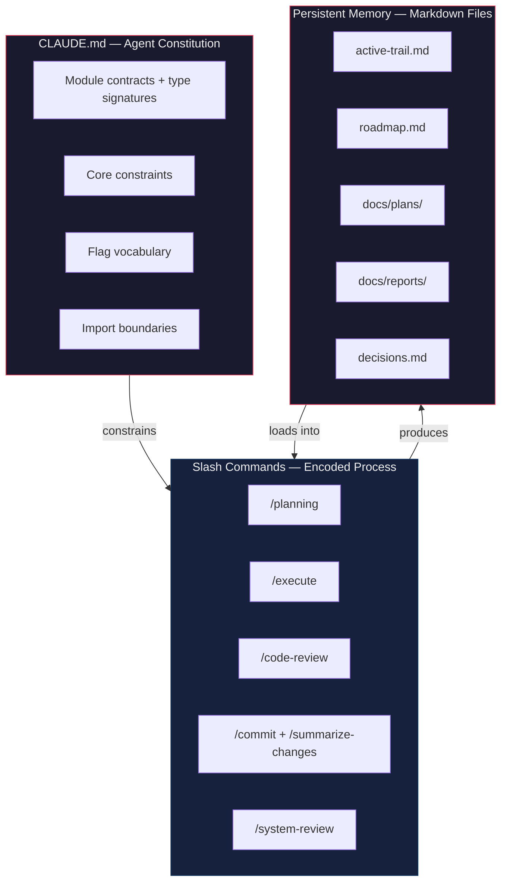
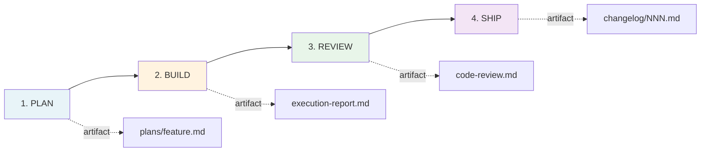

# Agent-Assisted Development Workflow

Building software with AI coding agents introduces a new category of engineering problems. The agent has no memory between sessions, drifts from instructions in long contexts, and can't tell you when it's confused — it just guesses. Left unconstrained, it produces code that works in isolation but violates project conventions, duplicates existing patterns, and accumulates invisible debt.

This document describes the workflow I've developed to make AI agents reliable contributors to a production codebase. The core insight: **treat the agent like a junior developer who needs excellent onboarding docs, a structured process, and code review from someone who wasn't in the room when the code was written.**

---

## The Problem

AI coding agents are stateless. Every session starts from zero. This creates three failure modes:

1. **Context loss** — The agent doesn't know what you built yesterday, what conventions you've established, or where you left off. It re-derives everything from scratch, often differently.
2. **Drift** — In long sessions, the agent gradually forgets earlier instructions. It starts following its own conventions instead of yours. By the end of a long session, the code style may have shifted.
3. **Invisible confidence** — The agent never says "I'm not sure." It commits to an approach and executes it fluently, even when the approach contradicts project constraints it was told about 40 messages ago.

## The Solution

Three interlocking systems that compensate for these failure modes:

---

## 1. CLAUDE.md — The Agent's Constitution

Every AI coding tool reads a project rules file at session start. Most projects put a paragraph or two here. This project's `CLAUDE.md` is 300+ lines and serves as the single source of truth for how the codebase works.

It contains:

| Section               | What it encodes                                                    | Why it matters                                              |
| --------------------- | ------------------------------------------------------------------ | ----------------------------------------------------------- |
| **Module contracts**  | Input/output types for every pipeline stage                        | Agent can't invent new interfaces or pass wrong types       |
| **Core constraints**  | Determinism, NFC normalization, flag-don't-guess, module isolation | Non-negotiable rules that every change must respect         |
| **Flag vocabulary**   | 15 named flags, each with setter and meaning                       | Agent can't invent new flags or misuse existing ones        |
| **Import boundaries** | Dependency graph between packages                                  | Agent can't create circular dependencies or break isolation |
| **Storage layout**    | Every file path, who reads/writes what                             | Agent can't put files in the wrong place                    |
| **Pipeline example**  | Full worked example from raw text to final output                  | Agent sees the exact transformation, not just a description |

The key design decision: **be exhaustively specific**. Vague rules ("keep it clean", "follow conventions") are worse than no rules because the agent thinks it's complying when it isn't. Specific rules ("use `structlog` with `document_id` bound, never `print()` or stdlib `logging`") are machine-verifiable.

---

## 2. Four-Session Development Cycle

Every feature follows the same four-session cycle. Each session starts fresh — the agent loads context from files, not from conversation history.

**Why separate sessions?** Two reasons:

1. **Review without implementation bias.** The reviewing agent has zero context from the build session. It reads the code from disk and evaluates it against `CLAUDE.md` contracts — the same way a human reviewer reads a PR they didn't write. This catches drift that occurred during the build.
2. **Context budget management.** Build sessions are expensive — context grows fast as the agent reads files, writes code, and runs tests. By the end, the agent is working with degraded attention. Starting fresh for review means the reviewer operates at full capacity.

Each session produces a **persisted artifact** (plan doc, execution report, code review, changelog). These are the agent's long-term memory — not conversation logs, but structured documents that any future session can load.

---

## 3. Slash Commands — Encoded Process

The workflow is encoded in 18 slash commands. Each command is a markdown file that the agent reads as instructions. The commands aren't suggestions — they're protocols with specific steps, output formats, and verification gates.

### Development Flow

| Command              | What it does                                 | Key mechanism                                                                        |
| -------------------- | -------------------------------------------- | ------------------------------------------------------------------------------------ |
| `/prime`             | Orient agent at session start                | Reads roadmap + active trail, checks for staleness against `git log`                 |
| `/brainstorm`        | Explore 2-4 approaches for a design decision | Produces comparison table with blast radius, reversibility, testing complexity       |
| `/planning`          | Create implementation plan                   | 163-line protocol with blast radius analysis, import verification, API detail checks |
| `/review-plan`       | Validate plan before building                | Catches gaps before expensive build session                                          |
| `/execute`           | Implement from plan                          | Task-by-task with self-review after each task, validation gate before completion     |
| `/code-review`       | Review code against contracts                | 8-phase review (contracts, isolation, logging, flagging, security, logic, tests)     |
| `/fix-code-review`   | Address review findings                      | Reads saved review file, fixes each finding                                          |
| `/commit`            | Conventional commit                          | Updates roadmap tracking automatically                                               |
| `/system-review`     | Improve the process                          | Analyzes execution report for process bugs, recommends command/rule updates          |
| `/summarize-changes` | Generate changelog                           | Cross-references with roadmap, publishes to Notion, checks golden files              |

### Issue Workflow

| Command          | What it does                                                                      |
| ---------------- | --------------------------------------------------------------------------------- |
| `/rca`           | Root cause analysis for a GitHub issue — traces code paths, assesses blast radius |
| `/implement-fix` | Apply fix from RCA document                                                       |
| `/rca-review`    | Review all RCAs for recurring patterns                                            |

### Tooling

| Command      | What it does                                                                          |
| ------------ | ------------------------------------------------------------------------------------- |
| `/analytics` | Analyze pipeline output — 300-line structured analysis with cross-document comparison |
| `/validate`  | Run all checks (ruff, mypy, pytest) and auto-fix                                      |
| `/test`      | Add or improve tests for a module                                                     |

### The Planning Command in Detail

The `/planning` command deserves special attention because it's where most of the accumulated wisdom lives. At 163 lines, it encodes lessons learned from dozens of plan-then-build cycles:

- **Blast radius analysis** — Trace every system flow affected by the change. Check pipeline contracts, manuscript state transitions, storage layout, model constructors. When adding a field to a dataclass, grep every constructor call site.
- **Import block verification** — Before finalizing imports, cross-check that every imported name actually appears in the task descriptions. Remove phantom imports.
- **API detail verification** — When the plan specifies library API calls, verify against docs. Don't assert API behavior from training data alone.
- **Plan size splitting** — If the plan exceeds 7 tasks or crosses dependency boundaries, split into sub-plans with explicit dependency handoff points.
- **Frontend cross-checks** — For template+CSS changes, enumerate every CSS class used in HTML and verify it exists in the stylesheet.

Each of these checks was added because a real build session diverged without it. The planning command is a living document of failure modes.

---

## 4. Persistent Memory

AI agents have no memory between sessions. These files compensate:

### Active Trail — Tactical Bookmark

A ~25-line file read at every session start. Contains:

- **Current focus** — what you're working on, link to plan doc, session status
- **Detours** — LIFO stack of branches from the main path (detours can nest)
- **Up next** — Top 3 ready items from the roadmap

The agent updates this automatically at each session boundary through the slash commands. No manual tracking required.

### Roadmap — Strategic Position

A visual timeline strip with a "YOU ARE HERE" marker plus an items table with status, effort, dependencies, and phase. Glance at it and know where you are in the overall build.

### Decision Log

Every non-obvious design decision is recorded in `docs/decisions/decisions.md` with resolution and rationale. When a future session asks "why does X work this way?", the answer is in the log — not buried in a conversation that expired months ago.

---

## 5. Self-Improving Process

The `/system-review` command closes the feedback loop. After each feature ships, it analyzes the execution report for **process bugs** — not code bugs:

- Was the divergence justified (plan was wrong) or problematic (execution drifted)?
- Where did the process break? Ambiguous plan? Missing constraint in `CLAUDE.md`? Unchecked edge case in the execute command?
- What should change to prevent recurrence?

This is how the planning command grew to 163 lines. Each check was a system review recommendation that proved its value. The process improves itself.

---

## 6. Git as Agent Memory

Git is the one system that persists across all sessions and tools. The workflow uses it as long-term memory:

- `**Context:` blocks** in commit messages document changes to AI context assets (commands, rules, `CLAUDE.md`). Future agents running `git log` can trace why a convention was introduced.
- **Session ID git notes** — A post-commit hook (`attach_session_to_commit.py`) attaches the Claude session ID to each commit via `git notes`. This links commits to the conversation that produced them.
- **Conventional commits** with module-scoped types (`feat(chunker):`, `fix(post-processor):`) make the evolution of each module traceable.

---

## Results

This workflow has produced 25+ features and fixes across a production codebase with:

- Consistent code style across all agent-written code (structlog, dataclasses, module isolation)
- Zero convention drift — the 50th feature follows the same patterns as the 5th
- Accumulated process improvements through system reviews
- Full traceability from commit to conversation to design decision

The tooling is portable: the same command set works in both Claude Code and Cursor (mirrored in `.claude/commands/` and `.cursor/commands/`). The approach generalizes to any AI coding agent that reads project-level instruction files.

---

*The meta-lesson: AI coding agents are powerful but stateless. The engineering challenge isn't getting the agent to write code — it's building the scaffolding so it writes the right code, consistently, across hundreds of sessions.*

---

Built by Dahni Strauss at [Accessible Futures AB](https://accessiblefutures.se).
